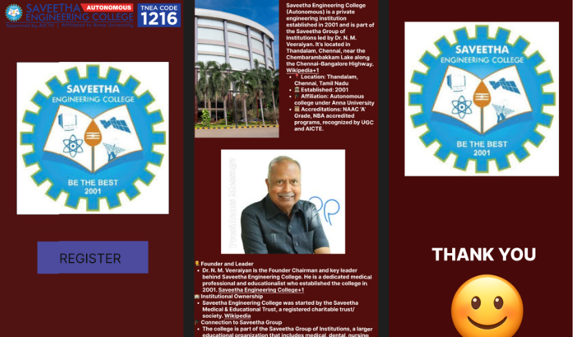

# Ex09 Event Registration Web Application
# Date:
# AIM:
To design, develop and deploy a web application for event registration.

# DESIGN STEPS:
## Step 1:
Create a new frame.

## Step 2:
Select any one preset size of your choice.

## Step 3:
Select the shapes you need.

## Step 4:
Import images as needed.

## Step 5:
Create pages based on your need and link them.

## Step 6:
Validate the HTML and CSS code.

## Step 6:
Publish the website in the given URL.

# DESIGN TOOL:
Figma

# CODE:
```
<!DOCTYPE html>
<html>
  <head>
    <meta name="viewport" content="width=device-width, initial-scale=1" />
    <meta charset="utf-8" />
    <link rel="stylesheet" href="globals.css" />
    <link rel="stylesheet" href="style.css" />
  </head>
  <body>
    <div class="iphone-pro-max">
      
      
      
      
      <div class="rectangle"></div>
      <div class="text-wrapper">REGISTER</div>
      
    </div>
  </body>
</html>

<!DOCTYPE html>
<html>
  <head>
    <meta name="viewport" content="width=device-width, initial-scale=1" />
    <meta charset="utf-8" />
    <link rel="stylesheet" href="globals.css" />
    <link rel="stylesheet" href="style.css" />
  </head>
  <body>
    <div class="iphone-pro-max">
      
      <p class="saveetha-engineering">
        <span class="text-wrapper"
          >Saveetha Engineering College (Autonomous) is a private engineering institution established in 2001 and is
          part of the Saveetha Group of Institutions led by Dr. N. M. Veeraiyan. It’s located in Thandalam, Chennai,
          near the Chembarambakkam Lake along the Chennai–Bangalore Highway.
        </span>
        <a
          href="https://en.wikipedia.org/wiki/Saveetha_Engineering_College?utm_source=chatgpt.com"
          target="_blank"
          rel="noopener noreferrer"
          ><span class="span">Wikipedia+1<br /></span
        ></a>
        <span class="text-wrapper"
          >📍 Location: Thandalam, Chennai, Tamil Nadu<br />🏛️ Established: 2001<br />🎓 Affiliation: Autonomous college
          under Anna University<br />📜 Accreditations: NAAC ‘A’ Grade, NBA accredited programs, recognized by UGC and
          AICTE.</span
        >
      </p>
      
      <p class="founder-and-leader">
        <span class="text-wrapper"
          >🧑‍⚖️ Founder and Leader<br />Dr. N. M. Veeraiyan is the Founder Chairman and key leader behind Saveetha
          Engineering College. He is a dedicated medical professional and educationalist who established the college in
          2001.
        </span>
        <a href="https://saveetha.ac.in/about-sec/?utm_source=chatgpt.com" target="_blank" rel="noopener noreferrer"
          ><span class="span">Saveetha Engineering College+1<br /></span
        ></a>
        <span class="text-wrapper"
          >🏫 Institutional Ownership<br />Saveetha Engineering College was started by the Saveetha Medical &amp;
          Educational Trust, a registered charitable trust/society.
        </span>
        <a
          href="https://en.wikipedia.org/wiki/Saveetha_Engineering_College?utm_source=chatgpt.com"
          target="_blank"
          rel="noopener noreferrer"
          ><span class="span">Wikipedia<br /></span
        ></a>
        <span class="text-wrapper"
          >🎓 Connection to Saveetha Group<br />The college is part of the Saveetha Group of Institutions, a larger
          educational organization that includes medical, dental, nursing, management, law, and other colleges.
        </span>
        <a href="https://isss.saveetha.in/about/?utm_source=chatgpt.com" target="_blank" rel="noopener noreferrer"
          ><span class="span">isss.saveetha.in<br /></span
        ></a>
        <span class="text-wrapper"
          >Dr. N. M. Veeraiyan heads this group and has played a central role in expanding these educational
          institutions over the years.</span
        >
      </p>
    </div>
  </body>
</html>

<!DOCTYPE html>
<html>
  <head>
    <meta name="viewport" content="width=device-width, initial-scale=1" />
    <meta charset="utf-8" />
    <link rel="stylesheet" href="globals.css" />
    <link rel="stylesheet" href="style.css" />
  </head>
  <body>
    <div class="iphone-pro">
      
      <div class="text-wrapper">THANK YOU</div>
      
    </div>
  </body>
</html>

```
# OUTPUT:
# RESULT:
The program to design, develop and deploy a web application for event registration is completed successfully.
